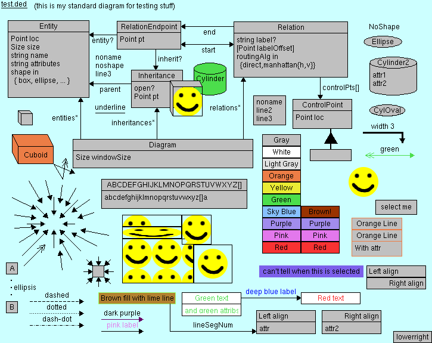

# Ded: A diagram editor

This is "Ded", a diagram editor intended to be used to make
boxes-and-arrows diagrams of the sort common when documenting software
systems.


# Features

## Basic diagramming

The core is boxes and arrows.

Boxes, which can represent entities in an entity-relationship diagram,
have a name and optionally some "attributes", additional text below
the name.  Boxes have a few shapes to choose from.

Arrows, which can represent relations, usually go between boxes.  When
a relation endpoint is connected to a box, it moves with the box.
Relation endpoints can just float in space however.  By default,
relations are drawn as straight line segments.  Control points can be
added to route them more precisely.  They are not "smart", but it is
fairly easy to route them aesthetically.

There are also inheritances, intended to represent specialization.
The main arrow always points at a "parent" entity (superclass).  Then,
other entities (subclasses) can be associated with it via relations.


## Efficient UI

I draw a lot of software diagrams.  This editor is intended to be
efficient for a proficient user to use a combination of mouse and
keyboard to accomplish most tasks.  Menus are provided primarily as a
learning aid.

Most operations snap to 5 pixels unless Shift is held.  5 pixels is
big enough that it's pretty easy to eyeball alignment, yet small
enough to allow fairly tightly packed diagrams when needed.

In dialogs, take note of the mnemonic letters on the labels.  When you
see a label with an underlined letter, press Alt+<letter> to jump to
the associated control.  Tabbing also works of course.  The dropdowns
also respond to keystrokes; type the first letter(s) of an item to
choose it.

Relatedly, every time the file is saved, it is exported as PNG.  That
only takes a moment (~200ms) and ensures you don't have to think about
explicit export.  Just save the file.


## Portable implementation

Ded uses Java and Swing for maximum portability.  All you need is the
JAR file and a JRE.

I know Swing is not great.  It is better than 10 years ago, but that
is not saying much.  Fortunately, I don't need much from it, and you
can't beat its portability.


## Small executable

Right now, the JAR file is only ~300 kB.  I won't promise to keep it
that small forever, but small size is important to me, so bloat will
have to be justified.  I won't pull in big libraries without good
reason.


## Portable diagrams

A given .ded file will appear the same on any machine, any OS, pixel
for pixel.  It exports to the same PNG, byte for byte.  This is really
important when you have a large development organization on lots of
platforms collaborating with diagrams.  The predecessor to Ded had
problems in this area; see
[comparison-to-ered.txt](doc/comparison-to-ered.txt).


## File format backward compatibility

As the tool evolves, the file format grows.  But it is versioned, and
the deserialization code designed to read *all* old formats.  It can
and will continue to read all of the JSON formats that have existed,
and all of the predecessor's binary formats.  I don't change the
format without ensuring the ability to read the previous format.


## Good interaction with revision control

I store all my diagrams in revision control along with their PNGs.  The
diagram JSON format is intended to be amenable to a certain amount of
automatic conflict resolution, and when that doesn't work, you can at
least eyeball the diff to see what changes the other person made.  The
PNG being always the same means that just exporting again isn't going
to introduce a spurious change.


## Ability to import and create diagrams of arbitrary graphs

The editor can semi-automatically create entities and relations that
depict elements of an arbitrary graph structure.  See
[Using ded to make diagrams of graphs](doc/diagrams-of-graphs.md).


## Hackable implementation

The source code is fairly well organized and well commented.  You
should be able to dive in and start hacking.

There are automated tests for serialization and deserialization.
(No automated UI tests though right now.)


## Gallery of diagram elements

This diagram shows most of the diagram features:




# Comparison to other tools

This list of other diagramming tools is far from exhausitve, of course;
they're just what else I've tried.  The short version of all of these is
I want something simple, fast, and convenient to use within a software
development workflow, and other tools did not meet all my requirements.


## Microsoft Visio (and Office generally)

[Microsoft Visio](https://en.wikipedia.org/wiki/Microsoft_Visio) is a
general-purpose diagramming tool, and at its core shares a similar idea
of having boxes (and other shapes) connected by arrows that
automatically follow their source and target entity.

However, Visio's many capabilities diminish its effectiveness for simple
diagrams; it takes more interaction effort to create a comparable
diagram for cases like the one above.

It is only available on Windows, and its files do not interoperate well
with revision control systems.

All of the the above also applies to PowerPoint and Word when used as
diagram editors.


## Xfig

[Xfig](https://en.wikipedia.org/wiki/Xfig) has somewhat better
portability, although still often a hassle to run on modern systems, and
acceptable revision control interaction.  It falls short on UI
efficiency, and the UI is extremely unconventional, making it harder for
others to collaborate.


## Balsamiq

[Balsamiq](https://en.wikipedia.org/wiki/Balsamiq) is a dedicated UI
wireframing tool.  DED has rudimentary features for UI wireframing.
See [comparison-to-balsamiq.txt](doc/comparison-to-balsamiq.txt) for
more details.


## ERED, the predecessor to DED

Only of historical interest;
see [comparison-to-ered.txt](doc/comparison-to-ered.txt).


# Building

To build it from the command line, run `make`.  The `Makefile` uses
GNU `make` syntax.

It will also build in Eclipse using the supplied project files.
There's nothing special in them though so you can disregard them
and use whatever IDE.

The only build dependency is the JDK.  It probably needs Java 1.5 or
later; I'm using 1.6 right now.

After building it, run the `ded` script, which does, in essence:

```
$ java -jar dist/ded.jar
```

Once it is running, Help|Help explains what to do.


# License

BSD license.  See [license.txt](license.txt).
