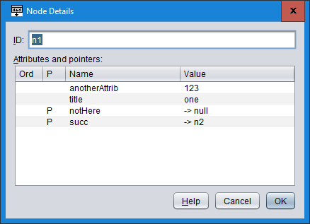
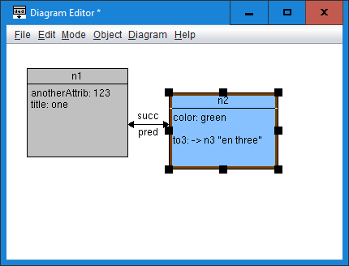
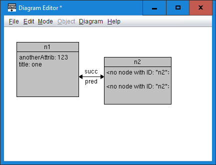

# Using ded to make diagrams of graphs

`ded` can be used to interactively explore and diagram arbitrary graph
structures.  It is not nearly as automatic as
[Graphviz](https://graphviz.org/), but is much more controllable.

The basic process is to create the graph as a JSON data structure (in
another program), import it into `ded`, then create diagram entities
corresponding to graph nodes, and diagram relations corresponding to
graph pointers.  Typically, only a subset of each will be used to make a
diagram, depending on its purpose.

## Graph format

In the JSON format, a graph is an object (dictionary) of key/value
pairs where the key is the ID of a node and the value is that node's
contents.

A node is itself an object containing fields, where the key is the
field name and the value is any JSON object, but typically a string
or number.

If a node field consists of an object with a string-valued `ptr` field,
and optionally a string-valued `preview` field, then it is treated as
a directed edge in the graph, pointing at the node whose ID equals the
value of the `ptr` field.  The `preview`, if present, is displayed in
the diagram when the pointer is *not* shown as a relation.

## Working example

As a simple example, this is the graph in `tests/objgraph.ded` in the
`ded` source tree:

```
{
  "n1": {
    "anotherAttrib": 123,
    "notHere": {"ptr": "null"},
    "succ": {"ptr": "n2"},
    "title": "one"
  },
  "n2": {
    "color": "green",
    "pred": {"ptr": "n1"},
    "to3": {
      "preview": "en three",
      "ptr": "n3"
    }
  },
  "n3": {"name": "Name of n3"},
  "n4": {"x": "ecks"}
}
```

I'll demonstrate the capability to make diagrams of graphs using this
example.

## Importing the graph

Start `ded`, then choose "Diagram -> Edit object graph...".  This dialog
will appear:


Copy and paste the above example JSON into the text box, replacing the
initial brace pair, then press OK.

## Adding a node

Now, choose "Diagram -> Add object graph node...".  This dialog appears:


Select the row with `n1` in the table and press OK.  The diagram now
looks like this:


Move the entity to the left side of the diagram, and resize it so all of
the text in the attributes area is visible:


## Adding a pointer

Right-click on the entity box for `n1` and choose
"Follow pointer -> succ".  Now the diagram looks like:


In the graph, there is a pointer called `succ` from `n1` to `n2`.
Consequently, in the diagram we now have a new entity labeled `n2`, and
a new relation labeled `succ` connecting the entity `n1` to the entity
`n2`.

Additionally, the `succ` attribute no longer appears in the attributes
area for `n1` because it is now shown as a relation.

Resize entity `n2` so all of its attributes can be seen:


## Adding a pointer to an existing node entity

Right-click on entity `n2` and choose "Follow pointer -> pred".  Now
the diagram looks like:


A new relation has been added, this time going from entity `n2` back
to entity `n1`.  (The relation's line appears on top of the previous
relation's line, but there is a new arrowhead and new label.  A control
point could be added to either relation to separate their lines.)

This illustrates that adding a pointer to a node that is already
associated with an entity will reuse that entity.

## Limiting what attributes are shown

In a given diagram, typically not all of the attributes present in the
graph are relevant.  Initially, the diagram shows all attributes, but
can be changed to only show selected attributes.

Let's use that to hide the `notHere` attribute in `n1`.  Right-click on
its entity, then choose "Show object node details".  This dialog
appears:



To hide `notHere`, we need to choose what to *show*.  To do that, edit
the "Ord" cells for `anotherAttrib` and `title` and put the numbers "1"
and "2" into them.  To edit a cell, either double-click it or press Tab
to activate the table, use the arrow keys to select the cell, and type
a number.  Press Enter to accept a changed cell value.

The edited table should look like this:


Press Ok.  Now the diagram looks like this:


The `notHere` attribute is no longer shown in `n1` because we did not
assign it a number.

However, all of the attributes in `n2` are also not shown, because the
set of displayed attributes is global.  To un-hide them, right-click on
entity `n2`, choose "Show object node details", and specify "Ord" values
of 3, 4, and 5:


Press OK and the `n2` attributes are once again visible:



The set of shown fields is maintained in an ordered sequence that is
visible in "Diagram -> Edit object graph configuration...".  That dialog
can also be used to export the set of fields from one graph and import
it into another with copy and paste (Ctrl+C/Ctrl+V).

## Customizing a graph node title and attributes

Double-click on entity `n1` to open the Edit Entity dialog:


The "Object graph node ID" field (lower-right) contains `n1`, meaning
this entity is associated with graph node `n1`.  The ID of an entity can
be changed at any time.

The "Name" field contains `$(graphNodeID)`, meaning the name shown in
the diagram is the same as the ID.  You can replace or augment the
variable substitution syntax to change what is displayed in the diagram.

The "Attributes" field contains `$(graphNodeShowFieldsAttrs)`, then
two newlines, then `$(graphNodeShowFieldsPtrs)`.  Again, these can be
replaced and/or augmented to change what is shown.  Click the "?"
beside the ID field to see all the available substitution variables.

The default Name and Attributes for a newly created entity corresponding
to a node can be overridden in the Object Graph Configuration dialog.

For now, just Cancel the dialog.

## Updating the graph

When building a diagram based on a graph, it is common to need to change
the underlying graph, for example to adjust the underlying data or to
add more information.  To do that, choose "Diagram -> Edit object graph...",
and paste in a new graph.  For the purpose of this example, paste in
this edited graph, which adds `moreInformation`, and renames `n2` to
`n2a`:

```
{
  "n1": {
    "anotherAttrib": 123,
    "notHere": {"ptr": "null"},
    "succ": {"ptr": "n2a"},
    "title": "one",
    "moreInformation": 7
  },
  "n2a": {
    "color": "green",
    "pred": {"ptr": "n1"},
    "to3": {
      "preview": "en three",
      "ptr": "n3"
    }
  },
  "n3": {"name": "Name of n3"},
  "n4": {"x": "ecks"}
}
```

Press Ok.  The diagram now looks like:



## Repairing the diagram after an import

The edit has changed the ID of a node (`n2` became `n2a`), and
consequently its entity contains an invalid ID, so the previously shown
attributes are no longer available.

We can fix this fairly easily: right-click on entity `n1` and choose
"Fix object graph neighbors".  This procedure, which operates on one
node at a time, examines the existing relations among node-associated
entites for any where the graph pointer is inconsistent with the entity
IDs.  In this case it sees that `n1.succ` points at `n2a`, but entity
`n1.succ` points at entity `n2`.  To fix the problem it simply changes
the ID of the destination entity to `n2a`.

The graph is now fixed:


To check that the diagram is fully repaired, choose "Diagram -> Check
object graph links...".  It should say "No issues detected."  Otherwise,
it will report all cases of entities with invalid IDs and relations that
start at a node-associated entity but do not correspond to any graph
pointer.

The final diagram, after saving, looks like this:


## Object graph sizes

Choose "Diagram -> Object graph sizes...".  This dialog appears:


This dialog shows how much space the graph takes up in the DED and PNG
files.  (The "?" buttons explain the details.)  It can also remove nodes
from the graph to reduce the space usage.  This is mainly useful if the
graph data is huge (megabytes or more).

## Recommended workflow

Successfully communicating the important information encoded in a large
graph is challenging and can be time-consuming; plan accordingly.

After importing a graph, use the "Add object graph node" command to
bring only the most important 5-10 nodes in at first.  Carefully study
the node details of the imported nodes to find and add the most
important relations.

Now, arrange the entities in the space of the diagram, trying to
communicate as much as possible just with spatial relations alone.

Then, add other relations and entities needed to tell the intended story
without overwhelming the reader.  Do not hesitate to use multiple
diagrams when needed; one of the big advantages of the graph-based
approach to diagramming is it makes it easy to create different subsets
of the same underlying data set.

The relations in particular can get messy as the default routing is not
smart and will tend to put them on top of each other.  One trick is to
set relations to use "direct" routing (select the relation and press the
"D" key) until you are ready to route that particular relation (select
it and press "H" or "V" to return to rectangular routing) by adding
control points.  Of course, `ded` itself could have more features to
help in this regard.

Another organizational trick is to make multiple entities with the same
node ID and place them adjacent to each other to make a crude
approximation of a non-rectangular entity to which relations can be more
easily and cleanly routed.

Remember that you can use colors to help organize the diagram and draw
the reader's attention to key parts.  Custom colors can be defined and
named under "Diagram -> Edit custom colors...".  Multiple entities can
be assigned a color at once by selecting them all (by clicking and
dragging, or by sequentially Ctrl+clicking), then right-click and "Set
fill color".

An example diagram that demonstrates these ideas is:


Nodes 14, 17, 40, and 18 form the "core" of the diagram, and it is their
spatial relations that most strongly influence the placement of the
rest.  Node 14 has a thin vertical "tail", with the same ID, that lets
some relations connect more easily.  For that matter, observe that nodes
40 and 18 are both taller than needed to contain their attribute text;
that is partly to emphasize importance, and partly to make relation
routing more natural and uniform.

Color is used to highlight the distinctive nature of the `Type` nodes,
to draw the eye to node 40 as the "focus node", and to give the
"Source Code" entity the appearance of almost "floating above" the
rest of the diagram, despite being entirely enclosed by node 18 (with
which it has no particular association).
